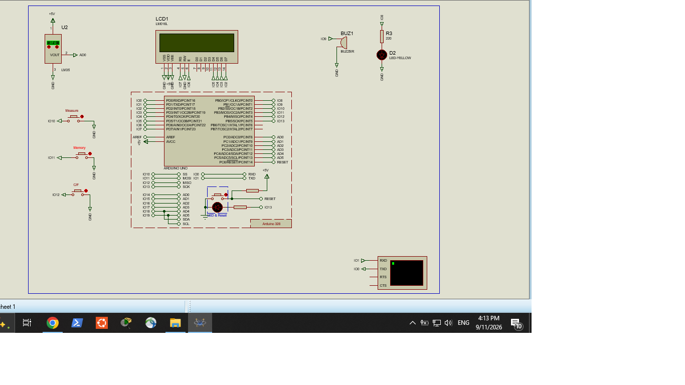

# ATmega328P Temperature Monitor

An educational embedded-systems project based on the **ATmega328P** microcontroller, an **LM35 temperature sensor**, LCD display, LED indicators, and an audible buzzer alarm.

The project was designed and tested in **Proteus** as a practical exercise in microcontroller programming, sensor interfacing, display control, and alarm management.

## Project Overview

The system measures temperature using an LM35 analog temperature sensor and processes the sensor signal using an ATmega328P.

The measured temperature is displayed on an LCD, while LEDs and a buzzer provide visual and audible status indication.

## Main Features

* 🌡️ Temperature measurement using **LM35**
* 🧠 **ATmega328P** microcontroller
* 📟 LCD temperature display
* 💡 LED status indicators
* 🔊 Audible buzzer alarm
* 🔬 Proteus circuit simulation
* 💻 Embedded C/C++ firmware
* 📐 Complete circuit schematic

## Hardware Components

| Component                         | Function                  |
| --------------------------------- | ------------------------- |
| ATmega328P                        | Main microcontroller      |
| LM35                              | Analog temperature sensor |
| LCD                               | Temperature display       |
| LEDs                              | Visual status indication  |
| Buzzer                            | Audible alarm             |
| Resistors & supporting components | Circuit operation         |

## How It Works

The LM35 generates an analog voltage proportional to the measured temperature.

The ATmega328P reads the analog signal through its ADC, converts the value into a temperature measurement, and displays the result on the LCD.

The system also uses LED indicators and a buzzer to provide status and alarm feedback.

```text
        ┌───────────────┐
        │     LM35      │
        │ Temperature   │
        │    Sensor     │
        └───────┬───────┘
                │ Analog Signal
                ▼
        ┌───────────────┐
        │   ATmega328P  │
        │               │
        │     ADC       │
        │  Processing   │
        │ Alarm Logic   │
        └───────┬───────┘
                │
        ┌───────┼────────┐
        ▼       ▼        ▼
      ┌────┐  ┌────┐  ┌──────┐
      │LCD │  │LEDs│  │Buzzer│
      └────┘  └────┘  └──────┘
```

## Circuit Schematic

The complete schematic of the temperature-monitoring circuit is included in the repository.



## Proteus Simulation

The project was developed and tested using **Proteus Design Suite**.

The Proteus project file is included in this repository:

**ATmega328P Temperature Monitor.pdsprj**

## Firmware

The microcontroller firmware is included in:

**ATmega328P Temperature Monitor.ino**

The firmware handles:

* ADC input from the LM35
* Temperature calculation
* LCD output
* LED status control
* Buzzer control
* Temperature alarm logic

## Repository Files

| File                                    | Description                |
| --------------------------------------- | -------------------------- |
| `ATmega328P Temperature Monitor.ino`    | ATmega328P firmware        |
| `ATmega328P Temperature Monitor.pdsprj` | Proteus simulation project |
| `Final_Schematic.jpg`                   | Complete circuit schematic |
| `README.md`                             | Project documentation      |

## Future Development

This project can be expanded into a more complete patient-monitoring platform.

Possible future additions include:

* ❤️ Heart-rate monitoring
* 🫁 SpO₂ / pulse-oximeter module
* 📈 Capnography / CO₂ monitoring
* Larger graphical LCD or TFT display
* Patient alarm management
* Data logging
* Serial/USB communication
* PC-based monitoring interface

## Project Status

**Status: Prototype / Educational Project**

The project is being developed incrementally, with individual functions tested in simulation before integration.

## Disclaimer

This project is intended for **educational and engineering development purposes**.

It is a prototype/simulation and is **not a certified medical device**. It must not be used for clinical diagnosis, treatment, or real patient monitoring.

## Technologies

* **ATmega328P**
* **LM35**
* **Arduino / Embedded C/C++**
* **Proteus Design Suite**
* LCD
* Embedded electronics

## Author

**Medical Patient Monitor — Embedded Systems Project**

An educational project focused on embedded systems, electronics, sensor interfacing, and medical-monitoring simulation.
